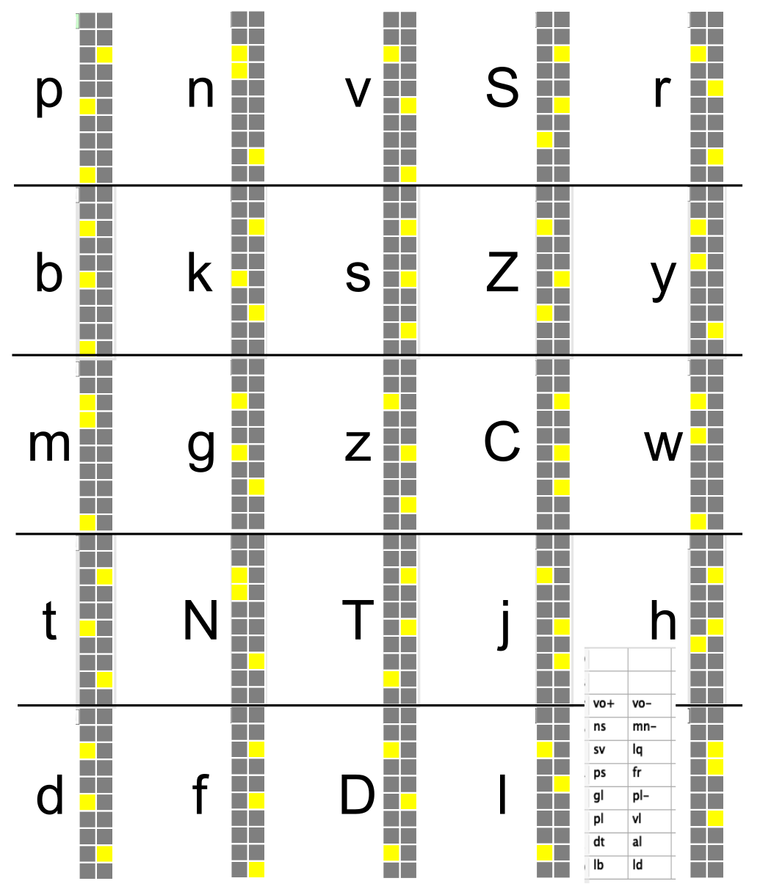
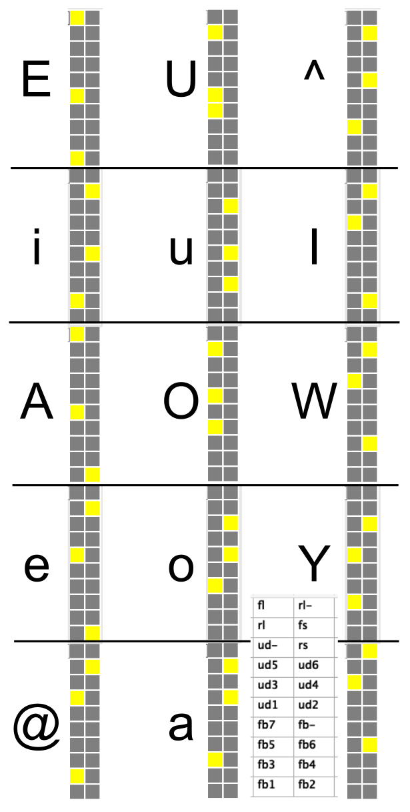

Back to [All Sims](https://github.com/CompCogNeuro/sims) (also for general info and executable downloads)

# Introduction

This simulation explores the way that regularities and exceptions are learned in the mapping between spelling (orthography) and sound (phonology), in the context of a "direct pathway" mapping between these two forms of word representations.

This is a large network, and it takes at least several 10's of mins or longer to train, so we start by loading pre-trained weights.

* Do `Open Trained Wts` in the toolbar.

# Phonology Patterns

The following two figures show the phonological patterns for the pools in the `Output` layer, with the specific phonological features shown in the lower right hand corner.  

**Consonant feature patterns.**  Features (left-right bottom-to-top): *Place:* lb = labial, ld = labiodental, dt = dental, al = alveolar, pl = palatal, vl = velar, gl = glottal, pl- = no place; *Manner:* ps = plosive, fr = fricative, sv = semivowel, lq = liquid, ns = nasal, mn- = no manner; vo+ = vocalized, vo- = not

**Vowel feature patterns.** Features: fb = front-back position (1-7); ud = up-down position (1-6); rs = round short, rl = round long, fs = flat short, fl = flat long, fl- = no round / flat.

# Reading Words

First, we will see that the network can read words that are presented to it, using a standard list of probe words developed by [Taraban & McClelland, 1987](#references).

* Note that the `TestingEnv` in the control panel is set to `Probe`, which is this set of words.  Do `Test Trial` in the toolbar.

The first word the network reads is "best," presented at the left-most edge of the input. You can read this word from the Ortho-graphy input layer from the individual letters within each of the 4 activated 3x9 slots. Each of these slots corresponds to one location and contains 26 units corresponding to one of the 26 letters of the alphabet (with one extra unused unit), organized from the bottom-left to upper-right as usual. To familiarize yourself with the layout of the input patterns, verify that "best" is in fact the pattern presented. 

The `TrlPhon` entry in the control panel decodes the Phon-ological output, by matching each phonological slot output pattern with the patterns for each of the consonants and vowels. A capital X indicates that the pattern does not exactly match any of the correct outputs. If you run the test prior to doing LoadWeights, it will be all X's. You should see that `TrlPhon` says `bbbestt` which is the correct repeated-consonant response for this word. If you want, you can look at the patterns in the `PhonConsPats` and `PhonVowelPats` tables and compare those with the outputs to see exactly how this information is encoded in the network. 

Also shown in the information just under the network, in the `Name` field, is a code for the type of word (which depends on the different testing sets) -- for this Probe test set, the codes are:

* HRC -- High freq regular consistent (e.g., best)
* HRI -- High freq regular inconsistent (e.g., bone, cf., done)
* HAM -- High freq ambiguous (e.g., brown, cf., blown)
* HEX -- High freq exception (e.g., both, cf., cloth)
* LRC -- Low freq regular consistent (e.g., beam)
* LRI -- Low freq regular inconsistent (e.g., brood, cf., blood)
* LAM -- Low freq ambiguous (e.g., blown, cf., brown)
* LEX -- Low freq exception (e.g., bowl, cf., growl)

Let's continue to observe the network's reading performance, observing specifically the translation invariance property.

* `Test Trial` for several more trials.

You should notice that the "best" input appears in successively more rightward positions in the input. Despite these differences in input location, the network produces the correct output. This spatial invariance coding, like the `objrec` model we explored in the Perception Chapter, requires the network to both maintain some information about the local ordering of the letters (so it pronounces "best" instead of "steb," for example), but also treat the entire pattern the same regardless of where it appears. We will see in a moment that this network developed the same general solution to this problem as the object recognition network, using a combination of locally spatially invariant and yet conjunctive encoding.

You can continue to observe the network's performance. Although you may observe an occasional error (especially as the items get lower in frequency and more irregular), the network should pronounce most words correctly -- no small feat itself given that there are nearly 3,000 words presented in as many as 4 different locations each! 

# Network Connectivity and Learning

Now, let's explore the connectivity and weights of the trained network.

* Click on `r.Wt` in the network view and click on some units on the left hand side of the `OrthoCode` layer, and then throughout the layer.

Notice that the left-most units receive from the left-most 3 letter slots, where each letter slot is a 3x9 pool of units. As you progress to the right in the OrthoCode pools, the units receive from overlapping pools of 3 letter slots.

As you click on these OrthoCode units, pay attention to the patterns of weights. You should notice that there are often cases where the unit has strong weights from the same input letter(s) across two or three of the slots, whereas other units encode sequences of different letters across the slots. This is just like the V2 units in the object recognition model in the Perception Chapter, which encode the same feature(s) regardless of location (spatial invariance), and also small combinations of different features (increasing featural complexity).

This invariant coding is just the kind of thing that the [Plaut, McClelland, Seidenberg, and Patterson (1996)](#references) (hereafter PMSP) hand-tuned input representations were designed to accomplish, as discussed in the main chapter, and we can see that this network learned them on its own.

* To see what the `Hidden` units are coding, click on different Hidden units and then go back and forth between the OrthoCode and Hidden units by noting the most strongly connected Hidden units for a given OrthoCode unit, etc.

The hidden layer units have more complex receptive fields that can encompass all of the orthography input slots, just like the IT units in the object recognition model. You should see the same patterns of spatial invariance and increased featural complexity. These units are in a position to encode the regularities of English pronunciation, and also the context sensitivity of these regularities. The conjunctions of input letters represented in the network play a similar role as the wickelfeatures of the [Seidenberg & McClelland, 1989](#references) (SM89) model and the hand-tuned conjunctive units in the PMSP model.

There are several important lessons from looking at the weights. First, the network seems to learn the right kinds of representations to allow for good generalization. These representations are similar to those of the V4 layer of the object recognition model in that they combine spatial invariance with conjunctive feature encoding. Second, although we are able to obtain insight by looking at some of the representations, not all are so easily interpretable. Further, once the network's complex activation dynamics are figured into the picture, it is even more difficult to figure out what is happening in the processing of any given input. As we know from the nature of the mapping problem itself, lots of subtle countervailing forces must be balanced out to determine how to pronounce a given word. Finally, the fact that we can easily interpret some units' weights is due to the use of Hebbian learning, which causes the weights to reflect the probabilities of unit co-occurrence.

* Poke around some more at the network's weights, and document a relatively clear example of how the representations across the OrthoCode and Hidden layers make sense in terms of the input/output mapping being performed.  Looking at the front row of OrthoCode in the central pool is a good strategy, for keeping track of where you are, and don't neglect the weights from Hidden to Phon output which can be particularly informative (use the above figures to decode which phonemes are encoded -- the first and last 3 pools are consonants, with vowels in the middle).  Each pool on the input has the letters of the alphabet in order, from left-to-right, bottom-to-top. You may want to decrease the Min/Max range in the color scale in the upper right (e.g., to -0.8 to 0.8) to better see the strongest weights.

> **Question 9.7:** Specify what OrthoCode units you have chosen (unit pool, row, col position within pool), what letters those OrthoCode units encode, and how the hidden unit(s) combine the OrthoCode units together -- describe how this combination of letters across locations makes sense in terms the need for both spatial invariance and conjunctive encoding of multiple letters.

# Nonword Pronunciation

We next test the network's ability to *generalize* by pronouncing nonwords that exploit the regularities in the spelling to sound mapping. A number of nonword sets exist in the literature -- we use three sets that PMSP used to test their model. The first set of nonwords is comprised of two lists, the first derived from regular words, the second from exception words [(Glushko, 1979)](#references). The second set was constructed to determine if nonwords that are homophones for actual words are pronounced better than those which are not, so the set is also comprised of two lists, a control list and a homophone list [(McCann & Besner, 1987)](#references). The third set of nonwords were derived from the regular and exception probe word lists that we used to test the network earlier [(Taraban & McClelland, 1987)](#references).

* Return to viewing the `Act` variable in the NetView, set `TestingEnv` to `Glushko`, do `Test All` then quickly hit `Stop` (the `Test All` sets the actual testing environment and resets to start of that).

You should see that network correctly pronounced the nonword "beed" by producing bbbEddd as the output.

* Continue to `Test Trial` through some more items on this and the other two testing lists (`Besner`, `Taraban`).

| Nonword Set               | ss Model | PMSP  | People |
|---------------------------|----------|-------|--------|
| Glushko regulars          | 95.3     | 97.7  | 93.8   |
| Glushko exceptions raw    | 79.0     | 72.1  | 78.3   |
| Glushko exceptions alt OK | 97.6     | 100.0 | 95.9   |
| McCann & Besner ctrls     | 85.9     | 85.0  | 88.6   |
| McCann & Besner homoph    | 92.3     | n/a   | 94.3   |
| Taraban & McClelland      | 97.9     | n/a   | 100.0  |

**Table 1** Comparison of nonword reading performance for our spelling-to-sound model (ss Model), the PMSP model, and data from people, across a range of different nonword datasets as described in the text. Our model performs comparably to people, after learning on nearly 3,000 English monosyllabic words.

The total percentages for both our model, PMSP (where reported) and the comparable human data are shown in Table 1 in the Language Chapter (reproduced above). Clearly, the present model is performing at roughly the same level as both humans and the PMSP model. Thus, we can conclude that the network is capable of extracting the often complex and subtle underlying regularities and subregularities present in the mapping of spelling to sound in English monosyllables, and applying these to nonwords in a way that matches what people tend to do.

* You can press `Test All` for each `TestingEnv` and click on the `TstEpcPlot` to see a plot of the overall generalization performance, and the `TstErrLog` table shows the errors for each case.

We tried to determine for each error why the network might have produced the output it did. In many cases, this output reflected a valid pronunciation present in the training set, but it just didn't happen to be the pronunciation that the list-makers chose. This was particularly true for the Glushko (1979) exception list (for the network and for people). Also, the McCann & Besner (1987) lists contain four words that have a "j" in the final set of phonemes after the vowel (the *coda*), `faije`,  `jinje`, `waije`, `binje`, which never occurs in the training set (i.e., in the entire corpus of English monosyllabic words). These words were excluded by PMSP, and we discount them here too. Nevertheless, the network did sometimes get these words correct.

> **Question 9.8:** Can you explain why the present model was sometimes able to pronounce the "j" in the coda correctly, even though none of the training words had a "j" there? (Hint: Think about the effect of translating words over different positions, e.g., the word "jet," in terms of the input the model receives.)

One final aspect of the model that bears on empirical data is its ability to simulate naming latencies as a function of different word features. The features of interest are word frequency and consistency (as enumerated in the Probe codes listed above). The empirical data shows that, as one might expect, higher frequency and more consistent words are named faster than lower frequency and inconsistent words. However, frequency interacts with consistency, such that the frequency effect decreases with increasing consistency (e.g., highly consistent words are pronounced at pretty much the same speed regardless of their frequency, whereas inconsistent words depend more on their frequency). The PMSP model shows the appropriate naming latency effects (and see that paper for more discussion of the empirical literature).

We assessed the extent to which our model also showed these naming latency effects by recording the average settling time for the words in different frequency and consistency groups for the Probe inputs (shown above). The results are shown in the `TstRTPlot` if you `Test all` on the `Probe` set. The model exhibits some of the appropriate main effects of regularity (e.g., HRC and LRC are both the fastest compared to all other condition, and the exception words, HEX and LEX, are the slowest), and also exhibits the critical interaction, whereby the most consistent words do not exhibit a frequency effect (HRC and LRC are statistically equivalent), and the low frequency exception words (LEX) are slower than the high frequency ones (HEX), but not by very much. Also, some of the other conditions are not entirely sensible. Overall, the frequency effects are very small in this model, likely because of the log compression on frequencies -- it takes much longer to train without this, but clearly the raw frequencies are more realistic.

# References

* Glushko, R. J. (1979). The organization and activation of orthographic knowledge in reading aloud. Journal of Experimental Psychology: Human Perception and Performance, 5, 674–691.

* McCann, R. S., & Besner, D. (1987). Reading Pseudohomophones: Implications for Models of Pronunciation and the Locus of the Word-Frequency Effects in Word Naming. Journal of Experimental Psychology: Human Perception and Performance, 13, 14–24.

* Plaut, D. C., McClelland, J. L., Seidenberg, M. S., & Patterson, K. (1996). Understanding normal and impaired word reading: Computational principles in quasi-regular domains. Psychological Review, 103, 56–115.

* Seidenberg, M. S., & McClelland, J. L. (1989). A distributed, developmental model of word recognition and naming. Psychological Review, 96, 523–568.

* Taraban, R., & McClelland, J. L. (1987). Conspiracy effects in word pronunciation. Journal of Memory and Language, 26, 608–631.

